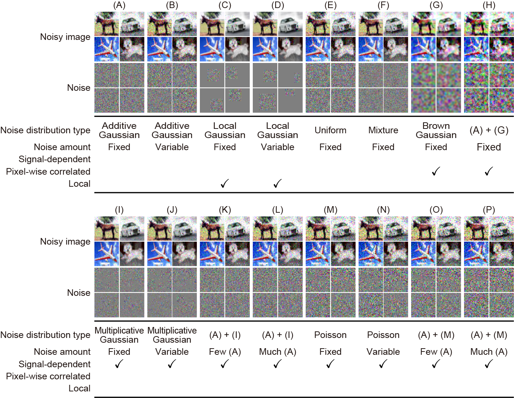
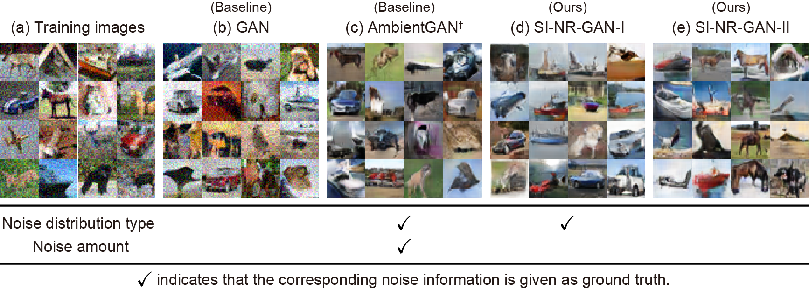
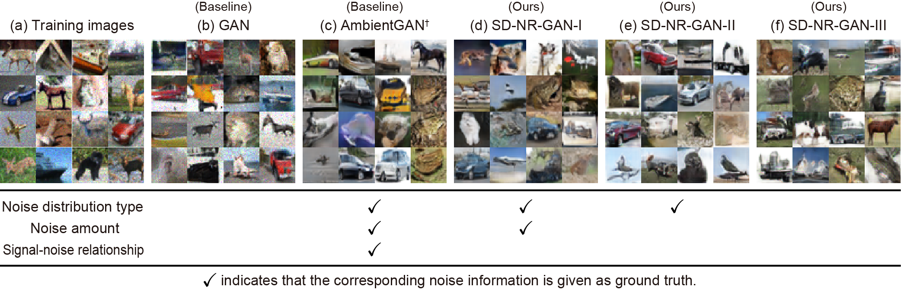

# NR-GAN: Noise Robust Generative Adversarial Networks (CVPR 2020)

This repository provides PyTorch implementation for [**noise robust GAN (NR-GAN**)](https://arxiv.org/abs/1911.11776).
NR-GAN is unique in that it can learn a *clean image generator* even when only *noisy images* are available for training.


**Note:**
In our previous studies, we have also proposed GAN for *label noise* and GAN for *ambiguous labels*.
In our follow-up study, we have also proposed GAN for *blur, noise, and compression*.
Please check them from the links below.

- [**Label-noise robust GAN (rGAN)**](https://takuhirok.github.io/rGAN/) (CVPR 2019)
- [**Classifier's posterior GAN (CP-GAN)**](https://takuhirok.github.io/CP-GAN/) (BMVC 2019)
- [**Blur, noise, and compression robust GAN (BNCR-GAN)**](https://takuhirok.github.io/BNCR-GAN/) (CVPR 2021)

## Paper

**Noise Robust Generative Adversarial Networks**.
[Takuhiro Kaneko](http://www.kecl.ntt.co.jp/people/kaneko.takuhiro/) and [Tatsuya Harada](https://www.mi.t.u-tokyo.ac.jp/harada/).
In CVPR, 2020.

[**[Paper]**](https://arxiv.org/abs/1911.11776) [**[Project]**](https://takuhirok.github.io/NR-GAN/) [**[Slides]**](docs/NR-GAN_slides.pdf) [**[Video]**](https://youtu.be/U0R5i8o_d40)

## Installation

Clone this repo:

```bash
git clone https://github.com/takuhirok/NR-GAN.git
cd NR-GAN/
```
First, install Python 3+. Then install PyTorch 1.3 and other dependencies by the following:

```bash
pip install -r requirements.txt
```

## Training

To train a model, use the following script:

```bash
bash ./scripts/train.sh [dataset] [model] [output_directory_path]
```

### Example

To train SI-NR-GAN-I (`sinrgan1`) on CIFAR-10 with additive Gaussian noise with a fixed standard deviation (`cifar10ag25`), run the following:

```bash
bash ./scripts/train.sh cifar10ag25 sinrgan1 outputs
```

The results are saved into `outputs`.

**Note:** In our experiments, we report the best model encountered during training to mitigate the performance fluctuation caused by GAN training instability.

### Options

Regarding `[dataset]`, choose one option among the following:

- `cifar10`: *No noise*
- `cifar10ag25`: *(A) Additive Gaussian noise with a fixed standard deviation*
- `cifar10ag5-50`: *(B) Additive Gaussian noise with a variable standard deviation*
- `cifar10lg25p16`: *(C) Local Gaussian noise with a fixed-size patch*
- `cifar10lg25p8-24`: *(D) Local Gaussian noise with a variable-size patch*
- `cifar10u50`: *(E) Uniform noise*
- `cifar10mix`: *(F) Mixture noise*
- `cifar10bg25k5`: *(G) Brown Gaussian noise*
- `cifar10abg25k5`: *(H) Sum of (A) and (G)*
- `cifar10mg25`: *(I) Multiplicative Gaussian noise with a fixed standard deviation*
- `cifar10mg5-50`: *(J) Multiplicative Gaussian noise with a variable standard deviation*
- `cifar10amg5_25`: *(K) Sum of few (A) and (I)*
- `cifar10amg25_25`: *(L) Sum of much (A) and (I)*
- `cifar10p30`: *(M) Poisson noise with a fixed total number of events*
- `cifar10p10-50`: *(N) Poisson noise with a variable total number of events*
- `cifar10pg30_5`: *(O) Sum of (M) and few (A)*
- `cifar10pg30_25`: *(P) Sum of (M) and much (A)*



Regarding `[model]`, choose one option among the following:

- `gan`: GAN
- `ambientgan`: *AmbientGAN*
- `sinrgan1`: *SI-NR-GAN-I*
- `sinrgan2`: *SI-NR-GAN-II*
- `sdnrgan1`: *SD-NR-GAN-I*
- `sdnrgan2`: *SD-NR-GAN-II*
- `sdnrgan3`: *SD-NR-GAN-III*

## Examples of generated images

#### CIFAR-10 with additive Gaussian noise
`cifar10ag25`: *(A) Additive Gaussian noise with a fixed standard deviation*



AmbientGAN<sup>†</sup> is trained with the ground-truth noise model, while the other models are trained without full knowledge of the noise (i.e., the noise distribution type and noise amount).

#### CIFAR-10 with multiplicative Gaussian noise
`cifar10mg25`: *(I) Multiplicative Gaussian noise with a fixed standard deviation*



AmbientGAN<sup>†</sup> is trained with the ground-truth noise model, while the other models are trained without full knowledge of the noise (i.e., the noise distribution type, noise amount, and signal-noise relationship).

## Citation
If you find this work useful for your research, please cite our paper.

```
@inproceedings{kaneko2020NR-GAN,
  title={Noise Robust Generative Adversarial Networks},
  author={Kaneko, Takuhiro and Harada, Tatsuya},
  booktitle={Proceedings of the IEEE/CVF Conference on Computer Vision and Pattern Recognition},
  year={2020}
}
```

## Related work

1. A. Bora, E. Price, A. G. Dimakis. [**AmbientGAN: Generative Models from Lossy Measurements**](https://github.com/AshishBora/ambient-gan/). In ICLR, 2018.
2. T. Kaneko, Y. Ushiku, T. Harada. [**Label-Noise Robust Generative Adversarial Networks**](https://takuhirok.github.io/rGAN/). In CVPR, 2019.
3. T. Kaneko, Y. Ushiku, T. Harada. [**Class-Distinct and Class-Mutual Image Generation with GANs**](https://takuhirok.github.io/CP-GAN/). In BMVC, 2019.
4. T. Kaneko, T. Harada.
[**Blur, Noise, and Compression Robust Generative Adversarial Networks**](https://takuhirok.github.io/BNCR-GAN/). In CVPR, 2021.